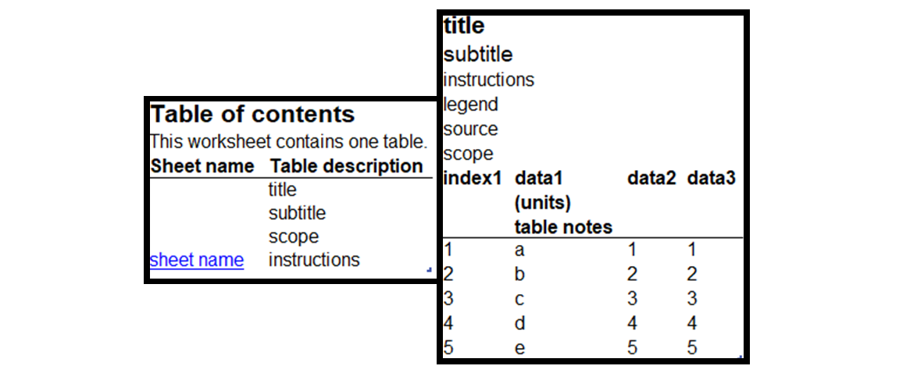

# Table elements

A `GPTable` is composed of a number of elements.

On the table of contents, sheet names are presented alongside the title, subtitles, scope
and instructions associated with the `GPTable`.

On the data spreadsheet, this information appears the top of the page with the source and legend.
The title is in large bold text.

The data table is underneath, with the column headings in bold. In the same row on new lines are the units and any table note references. These can be defined in the `GPTables` object.

Column headings, indices, and data are defined in a `pandas.DataFrame`. Up to the first 3
columns of the `pandas.DataFrame` can be used as index columns for the data in the rest of the columns.

The presentation of these elements can be adjusted with the use of [themes](../how_to/custom_theme.md) and [additional formatting](../how_to/additional_formatting.md).
