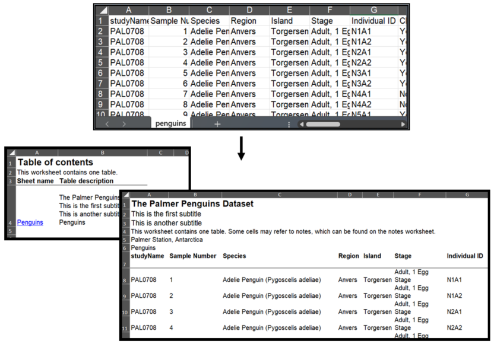
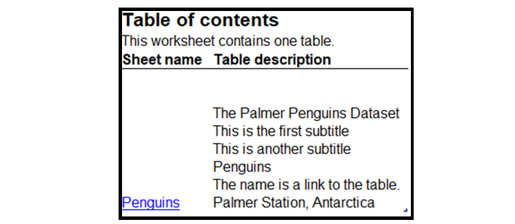
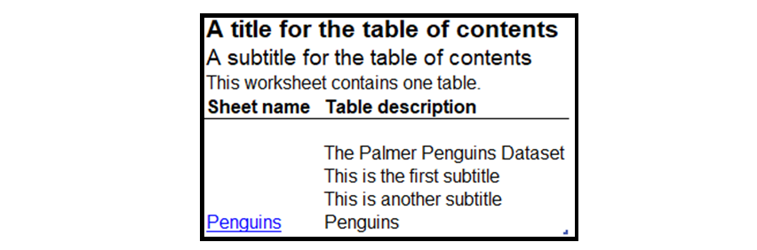
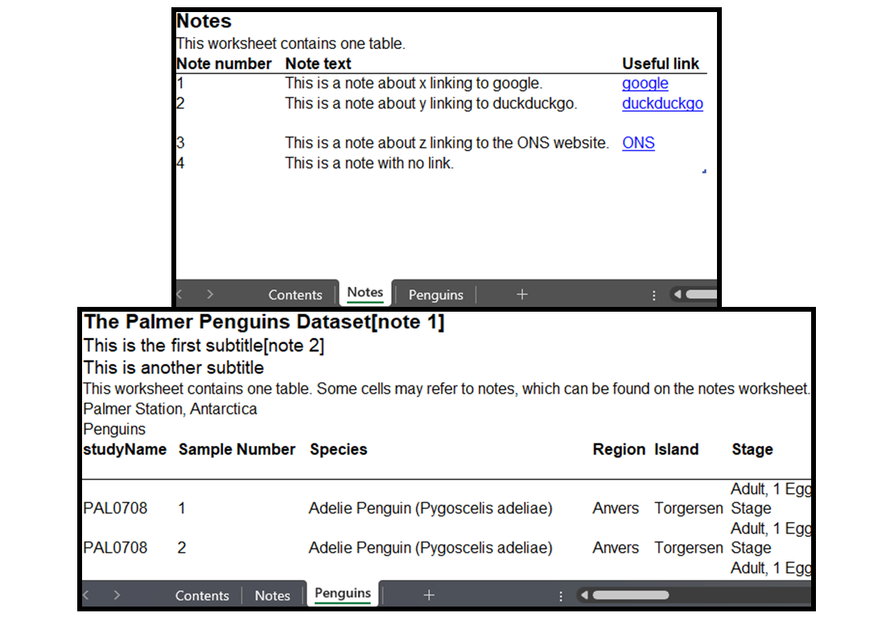
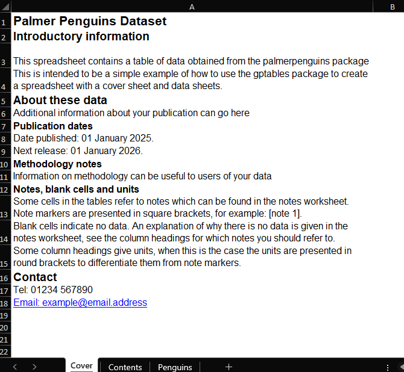

# Getting started with `gptables`

## Installation
To install gptables, simply use:

```
pip install gptables
```

## Tutorial

gptables helps produce consistently structured and formatted tables.

This section demonstrates basic use of the gptables with the Penguins dataset. More indepth information can be found in the how-tos and API docs.

The tutorial code can be run from the
[examples](https://github.com/ONSdigital/gptables/tree/main/gptables/examples) folder.

### Starting out

This example looks at how to produce a basic gptables spreadsheet of data from the Palmer Penguins dataset.
The data is first read in for presentation. Next, information about the data is supplied to
gptables. Then this information is used by gptables to produce the spreadsheet object. Finally, we
write out the spreadsheet.

First, import `gptables` alongside any other necessary packages so that the data can be read in. Any
additional preparation like cleaning can be done here, and the output should be a `pandas.DataFrame`.


```python
from pathlib import Path
import pandas as pd
import gptables as gpt

penguins_data = pd.read_csv("penguins.csv")
```

Then construct the `GPTable`, defining some main elements. These will be displayed in the resulting
spreadsheet.

```python
penguins_table = gpt.GPTable(
    table = penguins_data,
    table_name = "penguins_statistics",
    title = "The Palmer Penguins Dataset",
    subtitles = ["This is the first subtitle",
                 "This is another subtitle"],
    scope = "Penguins",
    source = "Palmer Station, Antarctica",
)
```

If preferred, this can alternatively be done using a dictionary of keyword arguments:

```python
kwargs = {
    "table_name": "penguins_statistics",
    "title": "The Palmer Penguins Dataset",
    "subtitles": ["This is the first subtitle",
                 "This is another subtitle"],
    "scope": "Penguins",
    "source": "Palmer Station, Antarctica",
}

penguins_table = gpt.GPTable(table = penguins_data, **kwargs)
```

Each table should be associated to a sheet name for writing. Collate the sheets with their names in
a dictionary:

```python
penguins_sheets = {"Penguins": penguins_table}
```

Finally, use `gptables.write_workbook()` to create and write out the workbook with the output path,
the sheets, and any additional elements.

```python
gpt.write_workbook(
    filename="python_penguins_gptable.xlsx",
    sheets=penguins_sheets,
    contentsheet_options={"additional_elements": ["subtitles", "scope"]},
)
```

`gptables` creates a table of contents, with worksheet labels linking to the worksheets, and a description of their contents. There is a sheet with the dataset, and it presents the
specified details in a minimal style with text of a legible font and size.



The code is combined below in an extendable tab.

??? "Starting out"
    ```python
    from pathlib import Path
    import pandas as pd
    import gptables as gpt

    penguins_data = pd.read_csv("penguins.csv")

    penguins_table = gpt.GPTable(
        table = penguins_data,
        table_name = "penguins_statistics",
        title = "The Palmer Penguins Dataset",
        subtitles = ["This is the first subtitle",
                    "This is another subtitle"],
        scope = "Penguins",
        source = "Palmer Station, Antarctica",
    )

    penguins_sheets = {"Penguins": penguins_table}

    gpt.write_workbook(
        filename="python_penguins_gptable.xlsx",
        sheets=penguins_sheets,
        contentsheet_options={"additional_elements": ["subtitles", "scope"]},
    )
    ```

### Table of contents

The description column in the table of contents can be customised by passing additional
elements from the `GPTable` into the `contentsheet_options` parameter
of `gptables.write_workbook()`.

`contentsheet_options` can take `additional_elements`, such as `'subtitles'`, `'scope'`,
`'source'`, or `'instructions'` to give more information about individual sheets within
the workbook:

```python
    penguins_table = gpt.GPTable(
        ...
        instructions="This workbook contains a single sheet. The name is a link to it."
        subtitles=["This is the first subtitle", "This is another subtitle"],
        scope="Penguins",
        source="Palmer Station, Antarctica",
        ...
    )

    ...

    gpt.write_workbook(
        filename=output_path,
        sheets=penguins_sheets,
        contentsheet_options={"additional_elements": ["instructions", "subtitles", "scope", "source"]},
    )
```



`contentsheet_options` also allows for customisation of the table of contents `title`, `subtitles`,
`table_name`, `instructions` and `column_names`. For example:

```python
    gpt.write_workbook(
        filename=output_path,
        sheets=penguins_sheets,
        contentsheet_options={"title": "A title for the table of contents",
                                "subtitles": ["A subtitle for the table of contents"],
                                "additional_elements": ["subtitles", "scope"]},
    )
```



Set `contentsheet_label = None` inside `gptables.write_workbook()` to disable creating
a table of contents.

More information can be found in the [function documentation](../api/functions/write_workbook.md).

### Notes

GPTables allows for attaching notes to tables by supplying `notes_table` to `produce_workbook()` or
`write_workbook()`. Notes are useful for adding footnotes, clarifications, or
extra information that helps users interpret the data.

Notes appear on a separate worksheet called `Notes`. They can be referenced in the `title`, `subtitles`,
`scope`, `source`, and `legend` elements. Notes cannot be added to individual data cells or column
headings.

Placeholders or references for notes are put in using the notation `$$note$$`, like `"Table title
$$Reference$$"`. These placeholders are replaced with numbered references in the final output.

```python
penguins_table = gpt.GPTable(
    ...
    title = "The Palmer Penguins Dataset$$note_about_x$$",
    subtitles = ["This is the first subtitle$$note_about_y$$",
                 "This is another subtitle"],
    ...
)
```

The note text must be provided as a `pandas.DataFrame` to the `notes_table` argument of
`gptables.write_workbook()`. This should contain the text of the placeholder
or reference, the text for the note, and optionally any hyperlinks to include with the note.

Below, note references are first created using a dictionary of lists before being converted into a
dataframe object. Note that all lists must be the same length - if a note has no link, use an empty
string `""` or `None` for that entry.

```python
notes = {
    "Note reference": ["note_about_x", "note_about_y", "note_about_z", "note_with_no_link"],
    "Note text": [
        "This is a note about x linking to google.",
        "This is a note about y linking to duckduckgo.",
        "This is a note about z linking to the ONS website.",
        "This is a note with no link."
    ],
    "Useful link": [
        "[google](https://www.google.com)",
        "[duckduckgo](https://duckduckgo.com/)",
        "[ONS](https://www.ons.gov.uk)",
        None
    ],
}
penguins_notes_table = pd.DataFrame.from_dict(notes)
```

When outputting the table, specify the reference table for the `Notes` sheet using `notes_table`.
```python
gpt.write_workbook(
    ...
    notes_table=penguins_notes_table,
    ...
)
```

The resulting spreadsheet contains a sheet `Notes` with the reference note text next to their assigned
note number. The sheet with the dataset `Penguins` shows the reference note numbers corresponding to
where they were assigned in the title and subtitle.



??? Notes

    ```python
    from pathlib import Path
    import pandas as pd
    import gptables as gpt

    penguins_data = pd.read_csv("penguins.csv")

    penguins_table = gpt.GPTable(table=penguins_data,
                                table_name = "penguins_statistics",
                                title="The Palmer Penguins Dataset$$note_about_x$$",
                                subtitles = ["This is the first subtitle$$note_about_y$$",
                                            "This is another subtitle"],
                                scope = "Penguins",
                                source = "Palmer Station, Antarctica")

    penguins_sheets = {"Penguins": penguins_table}

    notes = {
        "Note reference": ["note_about_x", "note_about_y", "note_about_z", "note_with_no_link"],
        "Note text": [
            "This is a note about x linking to google.",
            "This is a note about y linking to duckduckgo.",
            "This is a note about z linking to the ONS website.",
            "This is a note with no link."
        ],
        "Useful link": [
            "[google](https://www.google.com)",
            "[duckduckgo](https://duckduckgo.com/)",
            "[ONS](https://www.ons.gov.uk)",
            None
        ],
    }
    penguins_notes_table = pd.DataFrame.from_dict(notes)

    gpt.write_workbook(
        filename="penguins_with_notes.xlsx",
        sheets=penguins_sheets,
        notes_table=penguins_notes_table,
        contentsheet_options={"additional_elements": ["subtitles", "scope"]},
    )
    ```

The notes sheet `title`, `table_name` and `instructions`can be customised by supplying these to
the `notesheet_options` parameter in `write_workbook()` or `produce_workbook()`. An updated
label can be supplied to `notesheet_label`.

### Cover Sheet Example

This example uses the [Starting out](tutorial.md#starting-out) example above, and adds a cover sheet to the workbook.

Cover sheets can be used to provide information that is general to all tables in a workbook. See the [Analysis Function Guidance](https://analysisfunction.civilservice.gov.uk/policy-store/releasing-statistics-in-spreadsheets/#section-11) for more information about what to include in a cover sheet, and how to make sure it is accessible.
s
Note: Cover sheets are added as the first sheet in the workbook when written by `gptables`. This is important when applying additional formatting to other worksheets by their index in the workbook.

To include a cover sheet, first map your text elements to the attributes of a [Cover](../api/classes/cover.md) object:

```python
penguins_cover = gpt.Cover(
    cover_label = "Cover",
    title = "Palmer Penguins Dataset",
    intro=[
        "This spreadsheet contains a table of data obtained from the palmerpenguins package",
        "This is intended to be a simple example of how to use the gptables package to create a spreadsheet with a cover sheet and data sheets.",
    ],
    about=[
        "Additional information about your publication can go here",
    ],
    contact=[
        "Tel: 01234 567890",
        "Email: [example@email.address](mailto: example@email.address)",
    ],
)
```
This will automatically create a cover sheet with the subheadings "Introductory information", "About these data", and "Contact" where these attributes are included.

Add additional formatting to create further subheadings as needed:

```python
penguins_cover = gpt.Cover(
    cover_label = "Cover",
    title = "Palmer Penguins Dataset",
    intro=[
        "This spreadsheet contains a table of data obtained from the palmerpenguins package",
        "This an example of how to use the gptables package to create a spreadsheet with a cover sheet and data sheets.",
    ],
    about=[
        "Additional information about your publication can go here",
        [{"bold": True}, "Publication dates"],
        "This data tables in this spreadsheet were originally published at 7:00am 01 January 2025.",
        "The next publication will be published at 7:00am 01 January 2026.",
        [{"bold": True}, "Methodology notes"],
        "Information on methodology can be useful to users of your data",
        [{"bold": True}, "Notes, blank cells and units"],
        "Some cells in the tables refer to notes which can be found in the notes worksheet. Note markers are presented in square brackets, for example: [note 1].",
        "Blank cells indicate no data. An explanation of why there is no data is given in the notes worksheet.",
        "Some column headings give units, when this is the case the units are presented in round brackets to differentiate them from note markers.",
    ],
    contact=[
        "Tel: 01234 567890",
        "Email: [example@email.address](mailto: example@email.address)",
    ],
)

```

Finally, pass the cover object to the `cover_sheet` argument of the `gptables.write_workbook()` function:

```python
gpt.write_workbook(
    filename="python_penguins_gptable_with_cover.xlsx",
    sheets=penguins_sheets,
    cover_sheet=penguins_cover,
    contentsheet_options={"additional_elements": ["subtitles", "scope"]},
)
```
The resulting cover sheet is shown below.



The code is combined below in an extendable tab.

??? "Adding a cover sheet"
    ```python
    from pathlib import Path
    import pandas as pd
    import gptables as gpt

    penguins_data = pd.read_csv("penguins.csv")

    penguins_table = gpt.GPTable(
        table = penguins_data,
        table_name = "penguins_statistics",
        title = "The Palmer Penguins Dataset",
        subtitles = ["This is the first subtitle",
                    "This is another subtitle"],
        scope = "Penguins",
        source = "Palmer Station, Antarctica",
    )

    penguins_sheets = {"Penguins": penguins_table}

    penguins_cover = gpt.Cover(
        cover_label = "Cover",
        title = "Palmer Penguins Dataset",
        intro=[
            "This spreadsheet contains a table of data obtained from the palmerpenguins package",
            "This is intended to be a simple example of how to use the gptables package to create a spreadsheet with a cover sheet and data sheets.",
        ],
        about=[
            "Additional information about your publication can go here",
            [{"bold": True}, "Publication dates"],
            "Date published: 01 January 2025.",
            "Next release: 01 January 2026.",
            [{"bold": True}, "Methodology notes"],
            "Information on methodology can be useful to users of your data",
            [{"bold": True}, "Notes, blank cells and units"],
            "Some cells in the tables refer to notes which can be found in the notes worksheet. Note markers are presented in square brackets, for example: [note 1].",
            "Blank cells indicate no data. An explanation of why there is no data is given in the notes worksheet, see the column headings for which notes you should refer to.",
            "Some column headings give units, when this is the case the units are presented in round brackets to differentiate them from note markers.",
        ],
        contact=[
            "Tel: 01234 567890",
            "Email: [example@email.address](mailto: example@email.address)",
        ],
    )

    gpt.write_workbook(
        filename="python_penguins_gptable.xlsx",
        sheets=penguins_sheets,
        cover=penguins_cover,
        contentsheet_options={"additional_elements": ["subtitles", "scope"]},
    )
    ```
