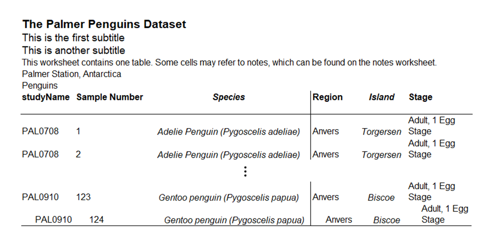

# Add additional formatting
There may be specific user needs or organisational reasons requiring 
formatting other than the `gptables` defaults. A wide range of options are possible
with the `gptable.GPTable(..., additional_formatting = ...)` parameter. See the [XlsxWriter documentation](https://xlsxwriter.readthedocs.io/format.html#the-format-class) for all formatting options.

!!! warning "Consider accessibility implications to formatting changes"
    Additional formatting changes the `gptables` defaults, which can introduce accessibility issues.
    Refer to the Releasing statistics in spreadsheets [guidance](https://analysisfunction.civilservice.gov.uk/policy-store/releasing-statistics-in-spreadsheets/) and consider user needs
    regarding accessiblity before adjusting the formatting.

## Using `additional_formatting`

The `gptable.GPTable(..., additional_formatting = ...)` parameter allows for specifying
columns, rows, and/or cells and the corresponding formatting changes to make.

!!! warning "Formatting conflicts"
    There are some conflicts between additional formatting options, for example wrapping
    and shrinking text. Outputs should be reviewed for correctness.

The option of what to format is specified, followed by the specific columns, rows, or cells,
and then the formatting changes. To change the properties of columns called Species and Island
to be center-aligned and italic, for example:

```python
sample_additional_formatting = [
    {
        "column": {
            "columns": ["Species", "Island"],
            "format": {
                "align": "center",
                "italic": True,
            },
        }
    }
]
```
Columns can be referenced by name or number. Rows may only be referenced by number, with `-1`
corresponding to the last row. Column and row numbers include indexes and column headings. Numeric indexing refers to position within the table, not the position in the output Excel sheet. Cell formatting takes highest precedence, followed by row formatting, and finally column formatting.

Multiple selections of columns, rows, and cells can be made in a single `additional_formatting` list.

```python
penguins_additional_formatting = [
    {
        "column": {
            "columns": ["Species", "Island"],
            "format": {
                "align": "center",
                "italic": True,
            },
        }
    },
    {
        "column": {"columns": [3], "format": {"left": 1}}
    },
    {
        "row": {
            "rows": -1,
            "format": {
                "bottom": 1,
                "indent": 2,
            },
        }
    },
]
```

This is combined with a basic example below in an extendable tab. The result is
italicisation of two columns, left bordering on the 4th column, and indentation in the final row.

??? "Using additional formatting"
    ```python
    import pandas as pd
    import gptables as gpt

    penguins_data = pd.read_csv("spenguins.csv")

    penguins_additional_formatting = [
        {
            "column": {
                "columns": ["Species", "Island"],
                "format": {
                    "align": "center",
                    "italic": True,
                },
            }
        },
        {
            "column": {"columns": [3], "format": {"left": 1}}
        },
        {
            "row": {
                "rows": -1,
                "format": {
                    "bottom": 1,
                    "indent": 2,
                },
            }
        },
    ]

    penguins_table = gpt.GPTable(
        table = penguins_data,
        table_name = "penguins_statistics",
        title = "The Palmer Penguins Dataset",
        subtitles = ["This is the first subtitle",
                    "This is another subtitle"],
        scope = "Penguins",
        source = "Palmer Station, Antarctica",
        additional_formatting = penguins_additional_formatting,
    )

    penguins_sheets = {"Penguins": penguins_table}

    wb = gpt.produce_workbook(
        filename="gptables_additional_formatting_example.xlsx",
        sheets=penguins_sheets
    )
    wb.close()
    ```



## Formatting text

Formatting can also be applied to the text in `title`, `subtitles`, `scope`, `source`
and `legend` elements, without using `additional_formatting`. Avoid using text formatting to represent data or important information, as most formatting is neither accessible nor machine readable.

Instead of a string, provide a list of strings and dictionaries containing valid [XlsxWriter format properties](https://xlsxwriter.readthedocs.io/format.html#format-methods-and-format-properties)
and values to the relevant parameter. The formatting defined in these dictionaries will be applied to the
next string in the list.  For example:

```python
formatted_subtitles = [
    "The first subtitle",
    [{"bold": True}, "This", " is another subtitle"],
]
```

This is combined with a basic example below in an extendable tab.

??? "Formatting text"
    ```python
    from pathlib import Path
    import pandas as pd
    import gptables as gpt

    penguins_data = pd.read_csv("penguins.csv")

    formatted_subtitles = [
        "The first subtitle",
        [{"bold": True}, "This", " is another subtitle"],
    ]

    penguins_table = gpt.GPTable(
        table = penguins_data,
        table_name = "penguins_statistics",
        title = "The Palmer Penguins Dataset",
        subtitles = formatted_subtitles
        scope = "Penguins",
        source = "Palmer Station, Antarctica",
    )

    penguins_sheets = {"Penguins": penguins_table}

    wb = gpt.produce_workbook(
        filename="additional_formatting_example.xlsx",
        sheets=penguins_sheets
    )
    wb.close()
    ```

This formatting is applied in addition to the
formatting of that element specified in the [`Theme`](../api/classes/theme.md).
!!! warning "Formatting of note references and links"
    Text formatting is not currently supported if the cell also contains note
    references or links. This may be changed in the future if there is
    sufficient user need, so please raise an issue if this is functionality
    you need.


## Further formatting

`gptables` outputs can also be built on with the [Format](https://xlsxwriter.readthedocs.io/format.html#the-format-class), [Workbook](https://xlsxwriter.readthedocs.io/workbook.html#the-workbook-class)
and [Worksheet](https://xlsxwriter.readthedocs.io/worksheet.html#the-worksheet-class) classes from
XlsxWriter.

!!! warning "Competing formatting"
    Some formatting will only occur where cells do not already have formatting applied,
    for example in the `gptables` global [theme](https://github.com/ONSdigital/gptables/blob/e0dc2348e8172972ddd6ea2f737cb6047f591780/gptables/themes/gptheme.yaml#L1-L4) settings.

    Consult the XlsxWriter [Worksheet class documentation](https://xlsxwriter.readthedocs.io/worksheet.html#the-worksheet-class) as well as the `gptables` [theme how-to](../how_to/custom_theme.md) for more information.

Worksheet properties can be altered directly, for example setting row height:

```python
ws = wb.worksheets()[0]
ws.set_row(0, 30)
```

Or, by using `Format` objects:

```python
italic_format = wb.add_format({"italic": True})
ws.set_column(
    2, 3, 10, italic_format
)
```

### Formatting methods

The following tables show the Excel format categories, along with an example demonstrating the syntax required
for use in gptables. Some formatting methods use indexing to map to Excel’s built-in formats. This information
can be found in the applicable sections below.

#### Font formatting

This table demonstrates the font formatting methods available. You can find all options
for [underline styles in the XlsxWriter documentation](https://xlsxwriter.readthedocs.io/format.html#format-set-underline).

| Description     | Example usage                                                                           |
|-----------------|-----------------------------------------------------------------------------------------|
| Font type       | {“font_name”: “Arial”}                                                                  |
| Font size       | {“font_size”: 30}                                                                       |
| Font colour     | {“font_color”: “red”}                                                                   |
| Bold            | {“bold”: True}                                                                          |
| Italic          | {“italic”: True}                                                                        |
| Underline       | {“underline”: 1}                                                                        |
| Strikeout       | {“font_strikeout”: True}                                                                |
| Super/Subscript | {“font_script”: 1} # Superscript<br/><br/><br/>{“font_script”: 2} # Subscript<br/><br/> |

#### Number formatting

This table demonstrates how to set the numeric format using indexing and string arguments. You can find all
options for [numeric formats in the XlsxWriter documentation](https://xlsxwriter.readthedocs.io/format.html#format-set-num-format).

| Description    | Example usage                                                                                         |
|----------------|-------------------------------------------------------------------------------------------------------|
| Numeric format | {“num_format”: 1} # Format index<br/><br/><br/>{“num_format”: “d mmm yyyy”} # Format string<br/><br/> |

#### Protection formatting

This table demonstrates the protection methods available.

| Description   | Example usage    |
|---------------|------------------|
| Lock cells    | {“locked”: True} |
| Hide formulas | {“hidden”: True} |

#### Alignment formatting

This table demonstrates the alignment formatting options available. You can find all options for
[horizontal and vertical alignment in the XlsxWriter documentation](https://xlsxwriter.readthedocs.io/format.html#format-set-align).

| Description      | Example usage               |
|------------------|-----------------------------|
| Horizontal align | {“align”: “center”}         |
| Vertical align   | {“align”: “vcenter”}        |
| Rotation         | {“rotation”: 30}            |
| Text wrap        | {“text_wrap”: True}         |
| Center across    | {“set_center_across”: True} |
| Indentation      | {“indentation”:2}           |
| Shrink to fit    | {“shrink”: True}            |

#### Pattern formatting

This table demonstrates the pattern formatting options available.

| Description       | Example usage         |
|-------------------|-----------------------|
| Cell pattern      | {“pattern”: 1}        |
| Background colour | {“bg_color”: “white”} |
| Foreground colour | {“fg_color”: “white”} |

#### Border formatting

This table demonstrates the border formatting options available. You can find all options
for [border styles in the XlsxWriter documentation](https://xlsxwriter.readthedocs.io/format.html#format-set-border).

| Description   | Example usage              |
|---------------|----------------------------|
| Cell border   | {“border”: 1}              |
| Bottom border | {“bottom”: 1}              |
| Top border    | {“top”: 1}                 |
| Left border   | {“left”: 1}                |
| Right border  | {“right”: 1}               |
| Border colour | {“border_color”: “red”}    |
| Bottom colour | {“bottom_color”:”#FF0000”} |
| Top colour    | {“top_color”: “red”}       |
| Left colour   | {“left_color”: “#FF0000”}  |
| Right colour  | {“right_color”: “red”}     |

For any formatting beyond this, if the package should support it then please raise an issue
or create a pull request. Otherwise, you will need to modify the underlying
[`GPWorkbook`](../api/classes/gpworkbook.md) or [`GPWorksheet`](../api/classes/gpworksheet.md) objects
before they are written to Excel.
