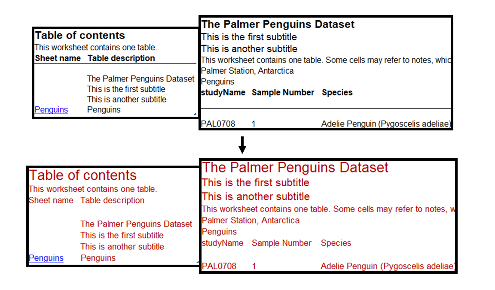
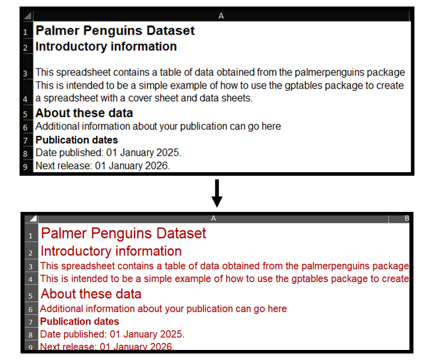

# Custom themes with `gptables`

It might be necessary to diverge from the `gptables` defaults for organisational
needs or user requirements. Where this is required regularly or across multiple teams, it can
be helpful for reproducibility and code readability to create a custom theme as opposed to supplying
an `additional_formatting` argument to `GPTable`.

!!! warning "Consider accessibility implications from custom themes"
    Using custom themes changes the `gptables` defaults, which can introduce accessibility issues.
    Refer to the Releasing statistics in spreadsheets [guidance](https://analysisfunction.civilservice.gov.uk/policy-store/releasing-statistics-in-spreadsheets/) and consider user needs
    regarding accessiblity before adjusting the formatting.

The sample code can be run from thes
[examples](https://github.com/ONSdigital/gptables/tree/main/gptables/examples) folder.

## Global formatting

A .yaml can reformat settings across the whole workbook from global settings, as well as
specified elements of the sheet. A basic example is shown below, where the order in which elements
appear on the datasheet is supplied under `description_order`.

```yaml
global:
    font_size: 13
    font_name: Arial
    font_color: '#AD0000'

title:
    font_size: 20

subtitle:
    font_size: 16

data:
    text_wrap: 1

description_order:
    - instructions
    - source
    - legend
    - scope
```

The path to the theme file or folder is supplied to the theme argument of `gptables.write_workbook()`
inside of `gptables.Theme()`:

```python
    gptables.write_workbook(
        filename=output_path,
        sheets=sheets,
        theme=gptables.Theme(theme_path),
        contentsheet_options={"additional_elements": ["subtitles", "scope"]},
    )
```

This is shown to have changed text colours and sizes as compared to the `gptables` defaults:



This is combined into an extendible code block below.

??? note "global formatting"
    ```python
    from pathlib import Path
    import pandas as pd
    import gptables as gpt

    penguins_data = pd.read_csv("penguins.csv")

    penguins_table = gpt.GPTable(
        table=penguins_data,
        table_name="penguins_statistics",
        title="The Palmer Penguins Dataset",
        subtitles=["This is the first subtitle",
                   "This is another subtitle"],
        scope="Penguins",
        source="Palmer Station, Antarctica",
    )

    penguins_sheets = {"Penguins": penguins_table}

    gpt.write_workbook(
        filename="gpt_custom_theme.xlsx",
        sheets=penguins_sheets,
        theme=gpt.Theme(example_theme_basic.yaml),
        contentsheet_options={"additional_elements": ["subtitles", "scope"]},
    )
    ```

## Element-wise formatting

Theme files can also be used to modify specific elements, such as the titles and subtitles
on the cover:

```yaml
global:
    font_size: 13
    font_name: Arial
    font_color: '#AD0000'

cover_title:
    font_size: 20

cover_subtitle:
    font_size: 18

data:
    text_wrap: 1

description_order:
    - instructions
    - source
    - legend
    - scope
```

This is shown to have formatted the sizes of the cover elements, with the global settings
dictating the other font sizes and colour throughout the workbook.



Additional options available for element-wise formatting can be found in the
[theme](https://github.com/ONSdigital/gptables/blob/main/gptables/themes/gptheme.yaml) file.
